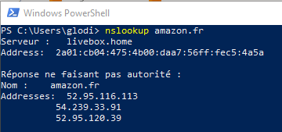

# Exercice 4 : résolution DNS

## Travail individuel (seul)

1. Trouvez les adresses IPV4 associées aux noms de domaine (nom d'hôte) suivants et les noter dans un fichier.

- `google.com`
- `amazon.fr`
- `facebook.fr`
- `msn.com`
- `orange.fr`
- `lequipe.fr`

#### Aide pour trouver une IP à partir du nom d'hôte

Pour trouver l'adresse IP associé à un nom d'hôte, vous pouvez utiliser la commande suivante à partir d'un terminal :

- `nslookup domain.com`

