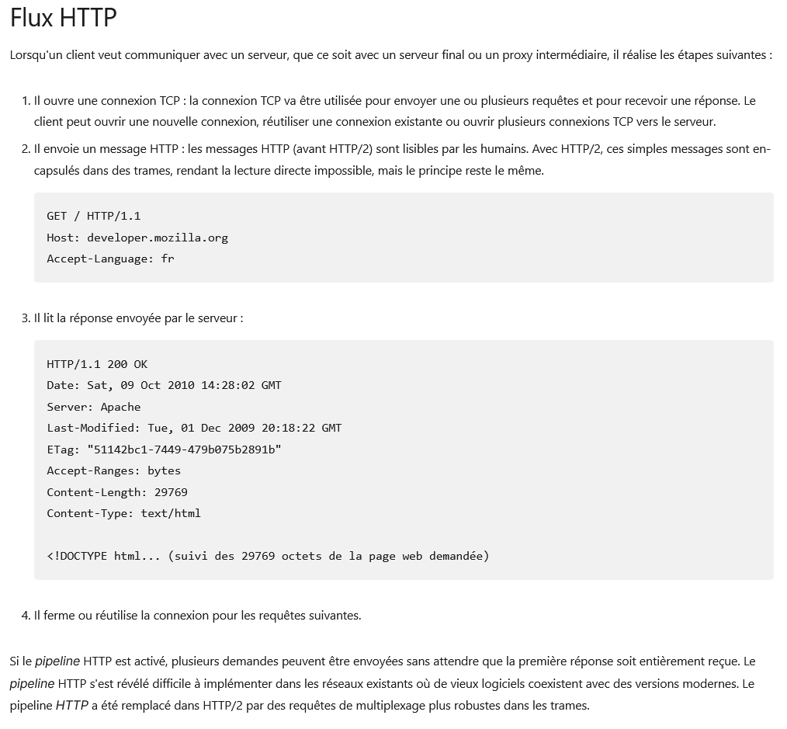

# Correction exercice 3 : protocole HTTP(S)

1. 
- [Article description de la communication entre un client et un serveur](http://www.steves-internet-guide.com/http-basics/)
- Extrait article [aperçu de HTTP](https://developer.mozilla.org/fr/docs/Web/HTTP/Overview)

2. Ce code est une énumération (liste fermée) dont les valeurs peuvent être regroupées dans 5 grandes familles:
 - 1xx : informations
 - 2xx : succès
 - 3xx : redirection
 - 4xx : erreur côté client
 - 5xx : erreur côté serveur
[Liste des codes HTTP](https://fr.wikipedia.org/wiki/Liste_des_codes_HTTP)